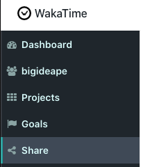
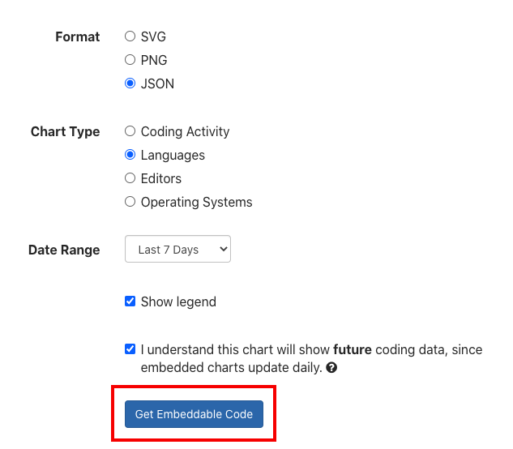
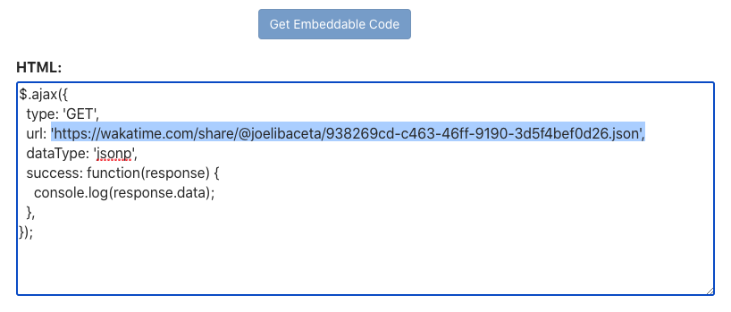
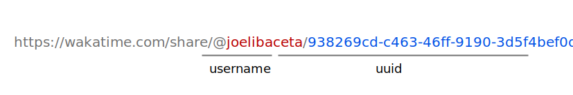

# wakatime-languages-pie-svg


## How to use

1. Go to your wakatime dashboard and select the share menu



2. Choose the follow options then press the `Get Embeddable Code`



3. You shoudl extract the exportable url



Get the params from the url



4. Prepare your img url


```html

```

